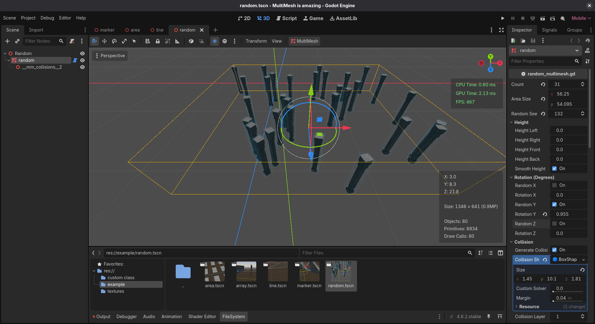
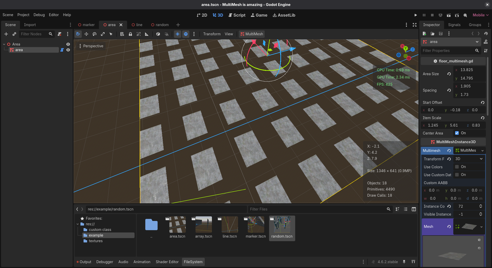
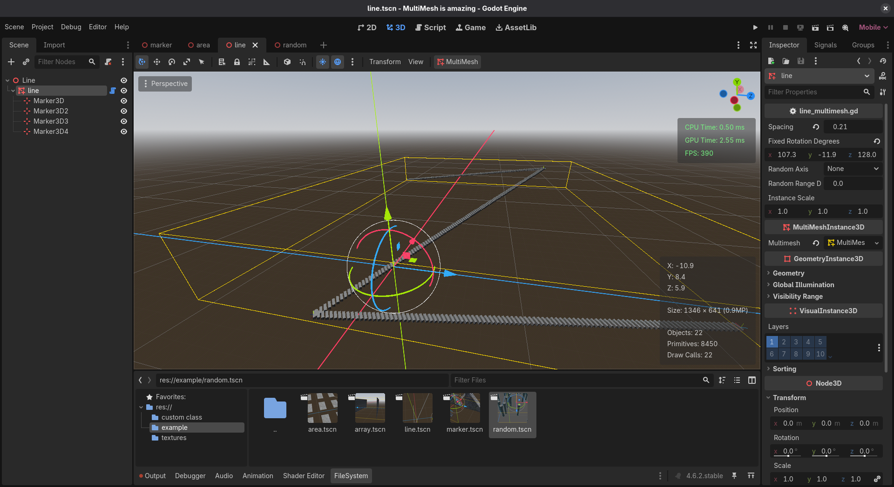
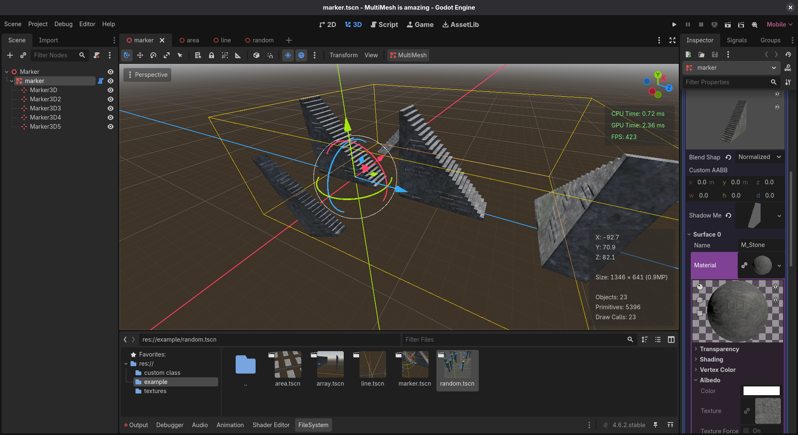
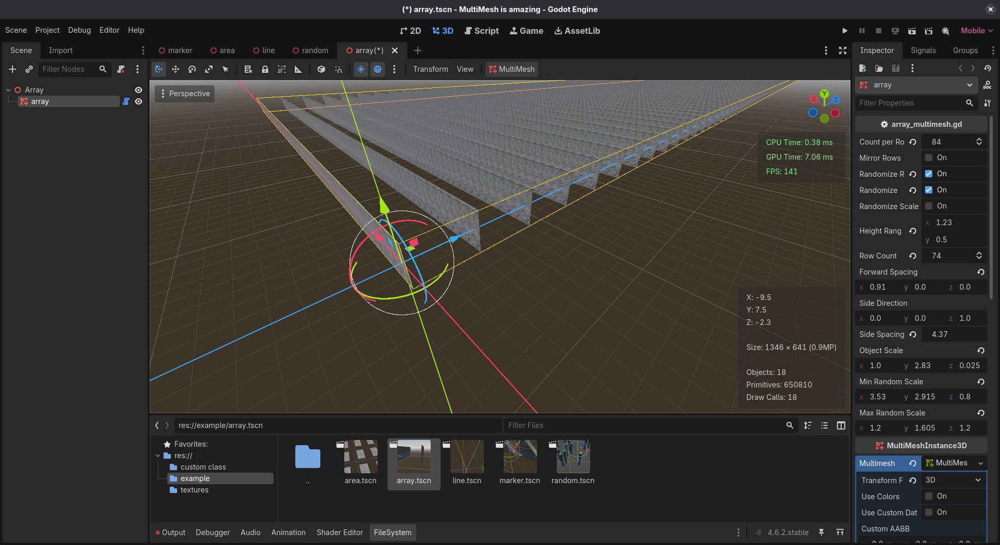

# Godot MultiMesh Tools

A collection of editor tools for creating and managing large amounts of objects using Godot's MultiMesh system.

Designed for environment artists and level designers who need a fast workflow and high rendering performance.

---

## Features

- MultiMesh-based rendering
- Editor Tool Support (`@tool`)
- Lightweight and easy to use
- Procedural generation
- Marker-based placement
- Collision generation
- Randomization options
- Optimized for large environments

---

## Video Showcase

Watch the full showcase and tutorial:

[▶ YouTube Video](https://youtu.be/5YNQaUsjLmw)

---

# Included Tools

## Random MultiMesh

Scatter objects randomly inside a specified area.

### Features

- Random placement
- Random rotation
- Random scale variation
- Seed support
- Height variation
- Collision generation
- StaticBody support

### Screenshot

---

## Floor MultiMesh

Generate grid-based MultiMesh layouts.

### Features

- Adjustable area size
- Adjustable spacing
- Scale control
- Offset support
- Centered generation

### Screenshot

---

## Line MultiMesh

Generate MultiMesh instances between Marker3D nodes.

### Features

- Marker-based workflow
- Adjustable spacing
- Rotation controls
- Random rotation support
- Scale control

### Screenshot

---

## Marker MultiMesh

Convert Marker3D positions directly into MultiMesh instances.

### Features

- Simple workflow
- Manual placement
- Live editor updates

### Screenshot

---
    
## Array MultiMesh

Generate organized rows and formations.

### Features

- Multiple rows
- Forward spacing
- Side spacing
- Mirrored rows
- Random scale
- Random rotation
- Random height variation

### Screenshot

---

# Performance

All tools use Godot's MultiMesh system to drastically reduce draw calls when rendering large numbers of identical objects.

Performance gains depend on:

- Mesh complexity
- Material count
- Shadow settings
- Instance count

These tools are intended for large-scale environments where standard MeshInstance3D placement becomes expensive.

---

# Tested With

- Godot 4.4
- Godot 4.5

---

# Installation

1. Download or clone this repository.
2. Copy the scripts into your project.
3. Create a MultiMeshInstance3D node.
4. Attach the desired script.
5. Assign your mesh.
6. Generate instances.

---

# License

MIT License

Feel free to use, modify, and include these tools in personal or commercial projects.

---

# Contributing

Issues and pull requests are welcome.

---

# فارسی

مجموعه‌ای از ابزارهای MultiMesh برای Godot 4 که به شما اجازه می‌دهد تعداد زیادی آبجکت را با عملکرد بسیار بهتر نسبت به MeshInstance3Dهای معمولی مدیریت کنید.

---

## ویدیوی آموزش

مشاهده آموزش و دموی کامل:

[▶ ویدیو یوتیوب](https://youtu.be/5YNQaUsjLmw)

---

# ابزارها

## Random MultiMesh

پخش تصادفی آبجکت‌ها در یک محدوده مشخص.

### امکانات

- موقعیت تصادفی
- چرخش تصادفی
- مقیاس تصادفی
- Seed ثابت
- تغییر ارتفاع
- تولید Collision
- پشتیبانی از StaticBody

### تصویر

---

## Floor MultiMesh

ساخت چیدمان شبکه‌ای با MultiMesh.

### امکانات

- تعیین ابعاد
- تعیین فاصله
- کنترل مقیاس
- Offset
- تولید از مرکز

### تصویر

---

## Line MultiMesh

قرار دادن آبجکت‌ها بین Markerها.

### امکانات

- سیستم Marker محور
- فاصله قابل تنظیم
- کنترل چرخش
- چرخش تصادفی
- کنترل مقیاس

### تصویر

---

## Marker MultiMesh

تبدیل Marker3Dها به Instanceهای MultiMesh.

### امکانات

- ساده و سریع
- چیدمان دستی
- بروزرسانی زنده در ادیتور

### تصویر

---

## Array MultiMesh

ساخت ردیف‌ها و آرایه‌های منظم.

### امکانات

- چند ردیف
- فاصله طولی
- فاصله عرضی
- ردیف آینه‌ای
- مقیاس تصادفی
- چرخش تصادفی
- ارتفاع تصادفی

### تصویر

---

# عملکرد

تمام ابزارها بر پایه MultiMesh ساخته شده‌اند و برای رندر تعداد زیاد آبجکت‌ها با Draw Call کمتر طراحی شده‌اند.

---

# نصب

1. ریپو را Clone یا دانلود کنید.
2. اسکریپت‌ها را داخل پروژه کپی کنید.
3. یک MultiMeshInstance3D بسازید.
4. اسکریپت موردنظر را متصل کنید.
5. Mesh را تنظیم کنید.
6. از ابزار استفاده کنید.

---

# لایسنس

MIT License

استفاده در پروژه‌های شخصی و تجاری آزاد است.
